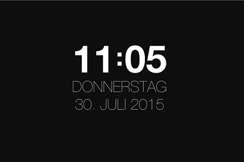
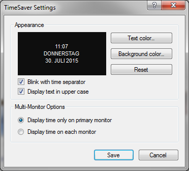

# TimeSaver
Windows Screensaver that displays the current time and date.

### Installation
- Download "<a href="raw/master/TimeSaver.scr">TimeSaver.scr</a>"
- Right click the downloaded file and choose "Install"
- Have fun ^^

### Screenshot

### Settings

